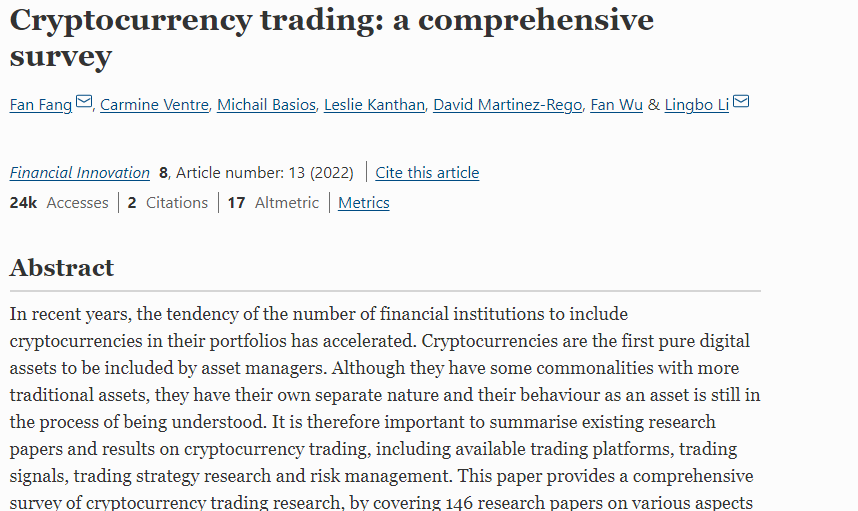
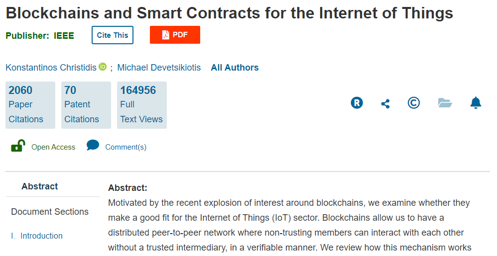
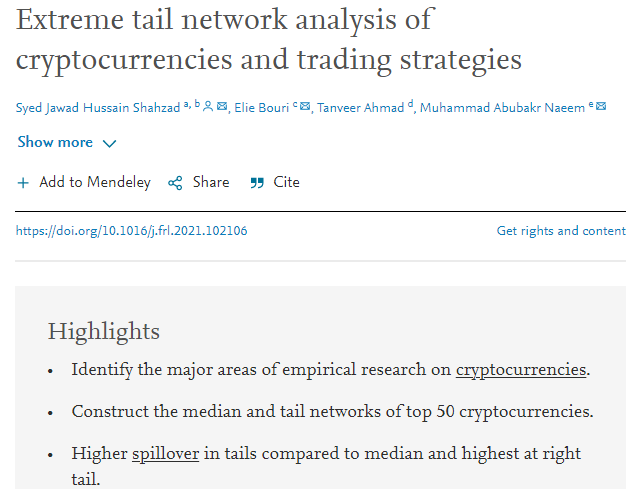

This study is going to analyze the Blockchain research papers and citations data. Raw data comes in csv format, however we have formatted the data to suite **visNetwork** package requirement. Firstly, you will see an interactive network visualization made with the help of **visNetwork** package, which will be followed by network analysis performed with the help of **igraph** package. 

```{r comment="", message=FALSE}
library(visNetwork)
library(readr)
library(readxl)
library(dplyr)
library(igraph)
```

## Interactive Graph

‘Edges.RData’ has two columns, to and from, showing the connections between nodes. ‘Nodes.RData’ has three columns; id, label, and group. **Id** numbers the papers from 1 to the number of rows, the **label** column has the Web of Science identifiers for the papers. Interestingly, we have divided the papers in groups based on their year of publication. Some NAs were removed to run a smooth and fruitful network graph.

```{r comment=""}
edges <- readRDS("edges.RData")
nodes <- readRDS("nodes.RData")
head(edges)
head(nodes)
```

```{r comment=""}
visNetwork(nodes, edges, width = "100%") %>%
  visIgraphLayout() %>%
  visNodes(
    shape = "dot",
    color = list(
      background = "#0085AF",
      border = "#013848",
      highlight = "#FF8000"
    ),
    shadow = list(enabled = TRUE, size = 10)
  ) %>%
  visEdges(
    shadow = FALSE,
    color = list(color = "#0085AF", highlight = "#C62F4B")
  ) %>%
  visOptions(highlightNearest = list(enabled = T, degree = 1, hover = T),
             selectedBy = "group") %>% 
  visLayout(randomSeed = 11)
```

## Network Analysis

```{r comment=""}
edges2 <- read_csv("citations.csv")

nodes2 <- read_xlsx("papers.xlsx")

colnames(edges2) <- c("from", "to")

colnames(nodes2)[2] <- "label"

nodes2 <- nodes2 %>%
  select(2,1,3:14)

graph2 <- graph_from_data_frame(edges2, directed = T,nodes2)
```
The size of the network, meaning the number of edges is **2788**. Number of nodes are **2050**.

```{r comment=""}
#graph2
gsize(graph2) 
gorder(graph2) 

V(graph2) 
E(graph2)
```

### Centrality Measures

#### Degree Centrality

##### Out Degree Centrality

```{r comment=""}
graph2_deg_out <- degree(graph2, mode = c("out"))
nodes2[nodes2$id == which.max(graph2_deg_out),"Article_Title"]
```



<br>

##### In Degree Centrality

```{r comment=""}
graph2_deg_in <- degree(graph2, mode = c("in"))
nodes2[nodes2$id == which.max(graph2_deg_in),"Article_Title"]
```


<br>

##### Total Degree Centrality

```{r comment=""}
graph2_deg_total <- degree(graph2, mode = c("total"))
nodes2[nodes2$id == which.max(graph2_deg_total),"Article_Title"]
```

#### Betweenness Centrality

```{r comment=""}
graph2_between <- betweenness(graph2, directed = T)
nodes2[nodes2$id == which.max(graph2_between), "Article_Title"]
```


<br>

### Measuring Network Structure

##### Network Density
```{r comment=""}
edge_density(graph2)
```


